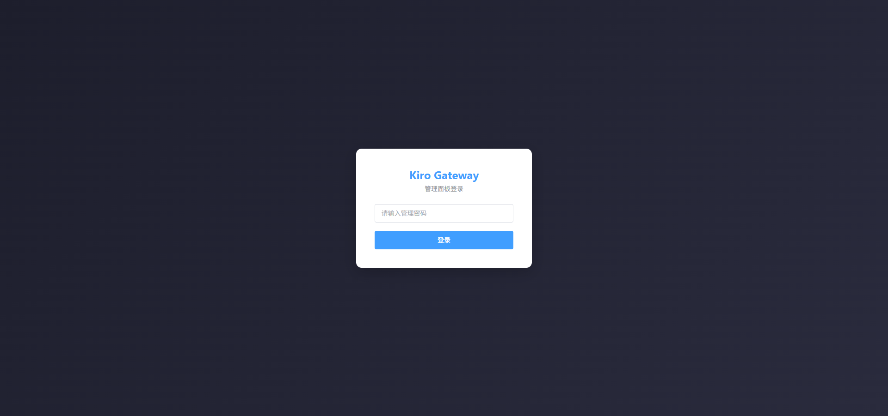
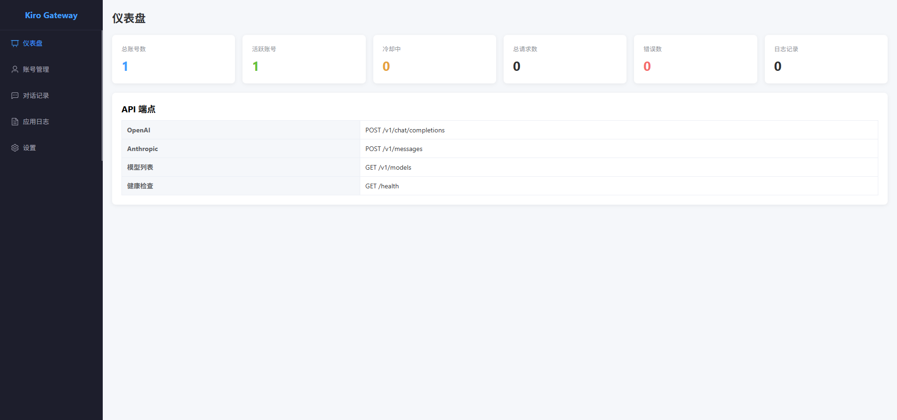
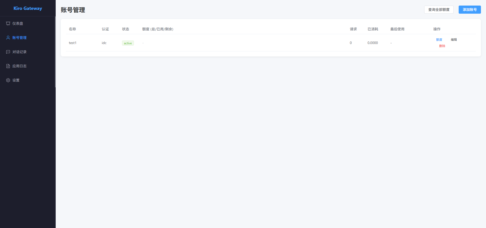
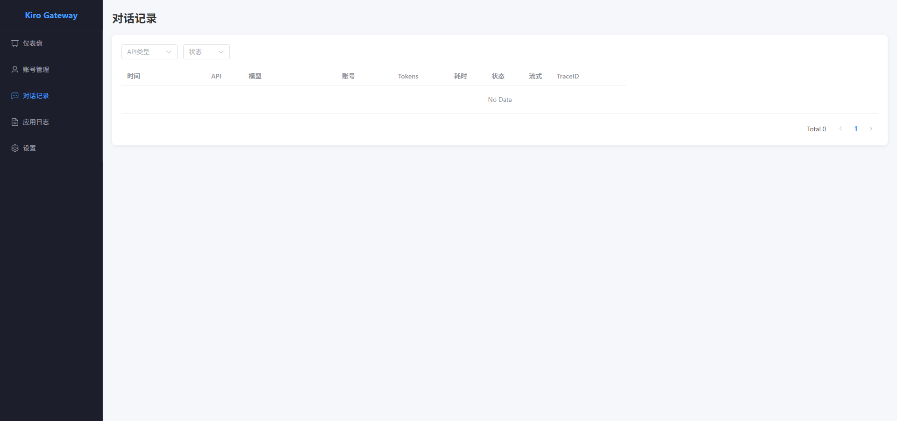
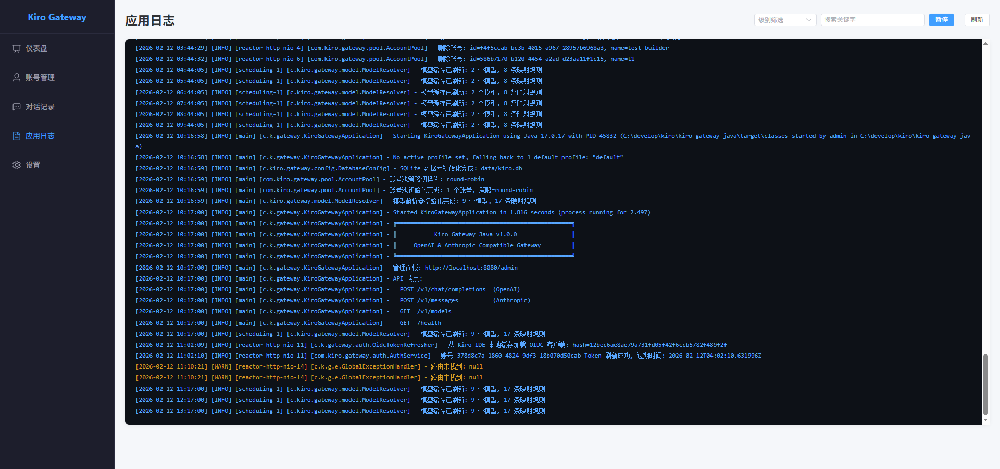
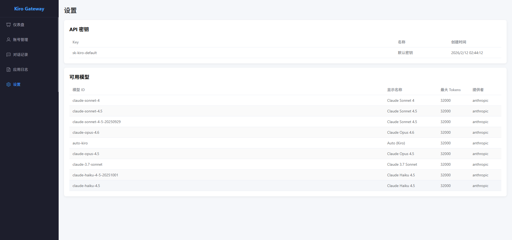

# Kiro Gateway Java 版本实现计划

综合 kiro-gateway (Python) 和 Kiro-Go (Go) 两个项目的优点，以 Java 最佳实践全新构建 Kiro API 代理网关，并提供完整的全链路请求/响应追踪能力。

---

## 〇、用户核心需求

1. **代码最佳实践** — 分层架构、接口抽象、异常显式抛出（不用 try-catch 吞异常）、卫语句提前返回、有意义的命名、注释写在代码前一行
2. **全链路追踪** — 可以看到每次请求的完整链路：客户端请求 → 转换后的 Kiro 请求 → Kiro 原始响应 → 转换后的客户端响应，支持在管理面板和日志文件中查看
3. **JSON 可视化** — 请求和响应的所有内容以 JSON 树形结构可视化展示，可展开/折叠
4. **对话记录** — 可以看到所有历史对话记录列表，点击查看每条对话的完整请求/响应详情
5. **前端 Vue 3** — 管理面板使用 Vue 3 构建
6. **日志持久化** — 应用运行日志、请求日志、追踪日志均持久化存储，支持文件轮转和数据库查询

---

## 〒、日志持久化设计

系统包含三类日志，全部持久化：

### 1. 应用运行日志（Logback 文件）
服务器运行时的所有日志输出，含 INFO/WARN/ERROR 等级别。

```yaml
# logback-spring.xml 配置策略
文件路径: data/logs/kiro-gateway.log
轮转策略: 按天 + 按大小（100MB）
保留策略: 最近 30 天 或 总大小 1GB
压缩:     gz 压缩历史文件
格式:     [%d{yyyy-MM-dd HH:mm:ss}] [%level] [%thread] [%logger] - %msg%n
```

| 文件 | 说明 |
|------|------|
| `data/logs/kiro-gateway.log` | 当前日志 |
| `data/logs/kiro-gateway.2026-02-12.0.log.gz` | 历史日志（压缩） |
| `data/logs/error.log` | 仅 ERROR 级别（快速定位问题） |

### 2. 请求日志（SQLite 持久化）
每次 API 请求的摘要信息，存入 SQLite `request_logs` 表，管理面板可查询。

```sql
CREATE TABLE request_logs (
    id INTEGER PRIMARY KEY AUTOINCREMENT,
    timestamp TEXT NOT NULL,
    trace_id TEXT NOT NULL,
    api_type TEXT NOT NULL,        -- 'openai' / 'claude'
    model TEXT,
    account_id TEXT,
    account_name TEXT,
    input_tokens INTEGER DEFAULT 0,
    output_tokens INTEGER DEFAULT 0,
    credits REAL DEFAULT 0,
    duration_ms INTEGER DEFAULT 0,
    success INTEGER DEFAULT 1,
    error_message TEXT,
    api_key TEXT,
    stream INTEGER DEFAULT 0,
    endpoint TEXT,                 -- 使用的 Kiro 端点
    created_at DATETIME DEFAULT CURRENT_TIMESTAMP
);
CREATE INDEX idx_request_logs_timestamp ON request_logs(timestamp);
CREATE INDEX idx_request_logs_trace_id ON request_logs(trace_id);
CREATE INDEX idx_request_logs_model ON request_logs(model);
```

### 3. 追踪日志（SQLite 持久化）
完整的四阶段请求/响应详情，存入 SQLite `traces` 表，管理面板 JSON 可视化查看。

```sql
CREATE TABLE traces (
    id INTEGER PRIMARY KEY AUTOINCREMENT,
    trace_id TEXT NOT NULL UNIQUE,
    timestamp TEXT NOT NULL,
    api_type TEXT NOT NULL,
    model TEXT,
    account_id TEXT,
    duration_ms INTEGER DEFAULT 0,
    success INTEGER DEFAULT 1,
    -- 四阶段完整数据（JSON 格式存储）
    client_request TEXT,           -- ① 客户端原始请求
    client_headers TEXT,
    kiro_request TEXT,             -- ② 转换后的 Kiro 请求
    kiro_endpoint TEXT,
    kiro_headers TEXT,
    kiro_status INTEGER,           -- ③ Kiro 响应
    kiro_events TEXT,              -- 原始事件列表(JSON)
    input_tokens INTEGER DEFAULT 0,
    output_tokens INTEGER DEFAULT 0,
    credits REAL DEFAULT 0,
    client_response TEXT,          -- ④ 客户端响应
    client_status INTEGER,
    error_message TEXT,
    created_at DATETIME DEFAULT CURRENT_TIMESTAMP
);
CREATE INDEX idx_traces_timestamp ON traces(timestamp);
CREATE INDEX idx_traces_api_type ON traces(api_type);
CREATE INDEX idx_traces_model ON traces(model);
```

### 日志持久化配置（application.yml）
```yaml
kiro:
  logging:
    # 应用日志
    file-path: data/logs
    max-file-size: 100MB
    max-history: 30
    total-size-cap: 1GB
    # 请求日志自动清理
    request-log-retention: 100000   # 保留最近 N 条
    request-log-cleanup-cron: "0 0 3 * * ?"  # 每天凌晨3点
    # 追踪日志自动清理
    trace-retention: 50000
    trace-cleanup-cron: "0 0 3 * * ?"
```

### 日志查看方式
| 日志类型 | 存储 | 查看方式 |
|---------|------|----------|
| 应用运行日志 | 文件 | 管理面板 **应用日志页**（实时尾随 + 级别筛选 + 关键字搜索） |
| 请求日志 | SQLite | 管理面板对话记录列表（分页/筛选/搜索） |
| 追踪日志 | SQLite | 管理面板对话详情页（JSON 可视化） |

---

## 一、代码最佳实践规范

### 架构原则
- **分层清晰**：Controller → Service → Client，职责单一
- **面向接口编程**：核心服务（认证、翻译、模型解析）均定义接口，实现类通过 Spring DI 注入
- **异常显式抛出**：不使用 try-catch 吞异常，业务异常通过自定义 RuntimeException 子类抛出，由全局异常处理器统一处理
- **卫语句优先**：用 if + return 提前退出，避免 else 嵌套
- **record 用于 DTO**：不可变数据传输对象使用 Java record
- **Builder 模式**：复杂对象构建使用 Builder（如 KiroPayload）

### 命名规范
- 类名 PascalCase，方法/变量 camelCase
- 中间变量、函数命名英文简写有意义
- 注释写在代码前一行，不追加在行尾
- 中文注释

### 代码风格
- 优先 `.属性` 替代 `.getXXX()`（record 天然支持）
- JSON 构造使用 `JSONObject.of()`
- SQL 关键字大写（如涉及 SQLite）
- `let` 优先替代 `var`（前端管理面板 JS 部分）

### 异常处理策略
```
自定义异常体系：
├── KiroGatewayException (RuntimeException)     # 基类
│   ├── AuthenticationException                  # 认证失败
│   ├── NoAvailableAccountException              # 无可用账号
│   ├── KiroApiException                         # Kiro API 调用失败
│   ├── ModelResolutionException                 # 模型解析失败
│   └── ConfigurationException                   # 配置错误

全局异常处理器 @RestControllerAdvice：
  → 统一转换为 OpenAI / Anthropic 格式的错误响应
```

---

## 二、全链路追踪设计

### 追踪模型
每个 API 请求生成唯一 `traceId`，记录 4 个阶段的完整数据：

```
┌─────────────────────────────────────────────────────────────┐
│                    TraceLog (一次请求)                        │
├────────────┬────────────────────────────────────────────────┤
│  traceId   │  uuid，贯穿全链路                                │
│  timestamp │  请求时间                                       │
│  api       │  "openai" 或 "claude"                          │
│  model     │  请求的模型名                                   │
│  accountId │  使用的账号 ID                                   │
│  durationMs│  总耗时                                         │
├────────────┼────────────────────────────────────────────────┤
│  ① client  │  clientRequest  — 客户端原始请求体 (JSON)        │
│    Request  │  clientHeaders  — 关键请求头                    │
├────────────┼────────────────────────────────────────────────┤
│  ② kiro    │  kiroRequest    — 转换后发给 Kiro 的请求体       │
│    Request  │  kiroEndpoint   — 使用的端点 URL                │
│             │  kiroHeaders    — 发送的请求头                  │
├────────────┼────────────────────────────────────────────────┤
│  ③ kiro    │  kiroStatus     — HTTP 状态码                   │
│    Response │  kiroRawEvents  — 原始 Event Stream 事件列表    │
│             │  inputTokens    — 输入 Token 数                │
│             │  outputTokens   — 输出 Token 数                │
│             │  credits        — 消耗 Credits                 │
├────────────┼────────────────────────────────────────────────┤
│  ④ client  │  clientResponse — 转换后返回客户端的响应 (JSON)   │
│    Response │  clientStatus   — 返回的 HTTP 状态码            │
│             │  error          — 如有错误，记录错误信息          │
└────────────┴────────────────────────────────────────────────┘
```

### 追踪实现方案

| 组件 | 说明 |
|------|------|
| `TraceContext` | 线程级上下文，持有 traceId + 各阶段数据 |
| `TraceLog` | 完整的追踪记录实体 |
| `TraceFilter` | WebFilter，在请求入口创建 TraceContext，请求结束时持久化 |
| `TraceStore` | 追踪记录存储（内存环形缓冲 + JSONL 文件），管理面板可查询 |
| `AdminController` | `/admin/api/traces` — 分页查询追踪记录；`/admin/api/traces/{traceId}` — 查看单条完整详情 |

### 追踪模式配置（application.yml）
```yaml
kiro:
  trace:
    # off: 不记录；brief: 只记录元数据；full: 记录完整请求/响应体
    mode: full
    # 内存中保留最近 N 条追踪记录（管理面板查看用）
    bufferSize: 500
    # JSONL 文件路径
    filePath: data/traces.jsonl
    # 单文件最大 MB（超过后轮转）
    maxFileSizeMb: 50
    # 是否脱敏（隐藏 accessToken 等）
    maskSensitive: true
```

### 日志输出示例
```
[TRACE:abc123] ← Client POST /v1/chat/completions model=claude-sonnet-4.5
[TRACE:abc123] → Kiro POST https://codewhisperer.../generateAssistantResponse account=acc1
[TRACE:abc123] ← Kiro 200 events=15 inputTokens=1200 outputTokens=350 credits=0.05
[TRACE:abc123] → Client 200 SSE chunks=12 duration=2340ms
```

---

## 二-B、对话记录 & JSON 可视化

### 对话记录列表页（ConversationsView）
管理面板中的核心页面，展示所有 API 请求的历史记录：

| 列 | 内容 |
|----|------|
| 时间 | 请求时间戳 |
| TraceID | 唯一追踪 ID（可点击跳转详情） |
| API 类型 | OpenAI / Claude |
| 模型 | 请求的模型名 |
| 账号 | 使用的账号邮箱/昵称 |
| Token | 输入/输出 Token 数 |
| 耗时 | 请求总耗时 |
| 状态 | 成功/失败 |

支持：分页、按时间/模型/状态筛选、搜索

### 对话详情页（ConversationDetailView）
点击某条对话后进入详情页，以 **4 个可展开面板** 展示完整链路：

```
┌──────────────────────────────────────────────┐
│  对话详情 - TraceID: abc-123                  │
│  时间: 2026-02-12 02:00:00  耗时: 2340ms      │
│  模型: claude-sonnet-4.5  账号: user@email    │
├──────────────────────────────────────────────┤
│                                              │
│  ▼ ① 客户端请求                               │
│  ┌─────────────────────────────────────────┐ │
│  │ {                                       │ │
│  │   "model": "claude-sonnet-4.5",         │ │
│  │   "messages": [                         │ │
│  │     ▶ { "role": "system", ... }         │ │
│  │     ▶ { "role": "user", ... }           │ │
│  │   ],                                   │ │
│  │   "stream": true                        │ │
│  │ }                                       │ │
│  └─────────────────────────────────────────┘ │
│                                              │
│  ▼ ② Kiro 请求（转换后）                       │
│  ┌─────────────────────────────────────────┐ │
│  │ JSON 树形展示 — 可展开/折叠每个节点        │ │
│  │ 端点: CodeWhisperer                     │ │
│  └─────────────────────────────────────────┘ │
│                                              │
│  ▼ ③ Kiro 响应                               │
│  ┌─────────────────────────────────────────┐ │
│  │ 状态: 200                               │ │
│  │ 事件列表:                                │ │
│  │   ▶ assistantResponseEvent ("你好...")   │ │
│  │   ▶ assistantResponseEvent ("我是...")   │ │
│  │   ▶ messageMetadataEvent (tokens: ...)  │ │
│  │ 输入Token: 1200  输出Token: 350          │ │
│  └─────────────────────────────────────────┘ │
│                                              │
│  ▼ ④ 客户端响应（转换后）                       │
│  ┌─────────────────────────────────────────┐ │
│  │ JSON 树形展示 — SSE chunk 列表           │ │
│  └─────────────────────────────────────────┘ │
│                                              │
└──────────────────────────────────────────────┘
```

### JSON 可视化组件（JsonViewer.vue）
- 使用 `vue-json-pretty` 或自定义组件
- 支持 **树形展开/折叠**，每个节点可独立控制
- 支持 **复制整个 JSON** 或 **复制某个节点值**
- 对象/数组显示元素数量提示
- 字符串、数字、布尔值不同颜色高亮
- 大文本（如 base64 图片）自动折叠并显示长度

---

## 三、四个项目优点分析

### kiro-gateway (Python) 的优点
- **智能模型解析**：4层解析管线（规范化 → 缓存 → 隐藏模型 → 透传）
- **VPN/Proxy 支持**：HTTP/SOCKS5 代理
- **模型名称标准化**：多种格式自动转换（日期后缀、版本号、legacy 格式）
- **连接池管理**：异步客户端复用连接
- **完善的错误处理**：网络错误、Kiro 错误分类处理
- **tiktoken 精确 Token 计数**

### Kiro-Go (Go) 的优点
- **多账号池**：轮询负载均衡 + 错误冷却（配额1h / 连续错误1min）
- **Web 管理面板**：可视化管理
- **丰富认证方式**：Builder ID / IAM SSO / SSO Token / 凭证 JSON / Social
- **双端点回退**：CodeWhisperer → AmazonQ（429时自动切换）
- **用量追踪**：每账号请求数、Token 数、Credits 统计
- **Thinking 模式可配置**：后缀、输出格式均可自定义
- **AWS Event Stream 二进制解析**：直接解析原始二进制协议
- **账号导入导出**：兼容 Kiro Account Manager 格式
- **请求日志 JSONL**：管理面板可查看

### Kiro2api-Node (Node.js) 的优点
- **SQLite 数据库存储**：账号、设置、请求日志、模型配置全部用 SQLite，WAL 模式并发性能好
- **数据库迁移系统**：版本化迁移脚本，自动从 JSON 迁移到 SQLite
- **多种账号池策略**：round-robin / random / least-used 三种可选
- **多 API Key 管理**：支持多个 API Key + 名称标签，触发器防止删除最后一个
- **模型映射数据库表**：pattern 匹配（contains/exact/regex）+ 优先级排序
- **SSE 实时更新推送**：管理面板通过 `/api/events` SSE 端点实时获取状态变化
- **请求日志自动清理**：定时清理旧日志，保留最近 N 条
- **批量操作**：批量导入/删除账号
- **工具名称安全化**：sanitizeToolName 处理特殊字符避免 API 报错

### KiroGate (Python Fork) 的优点
- **智能 Token 分配器**：基于评分的选择算法（成功率60% + 新鲜度20% + 负载均衡20%）
- **Prometheus 风格 Metrics**：延迟直方图、请求计数器（按端点/状态码/模型）、持久化到 SQLite
- **WebSearch 工具支持**：Anthropic web_search 工具转换为 Kiro MCP API 调用
- **请求限流 (Rate Limiting)**：防止滥用
- **自动重试 + 指数退避**：403/429/5xx 自动重试，delay * 2^attempt
- **历史消息图片压缩**：历史消息中的图片自动替换为占位符，减小请求体
- **Token 刷新防抖**：asyncio.Lock 防止并发刷新竞争
- **AuthManager LRU 缓存**：多租户支持，OrderedDict LRU 淘汰
- **Token 健康检查后台任务**：定期验证所有活跃 Token 的有效性
- **IP 黑名单**：管理员可封禁 IP
- **请求追踪中间件**：每个请求生成唯一 requestId 用于日志关联
- **Pydantic Settings**：类型安全的配置管理和验证

---

## 四、技术栈选型

| 组件 | 选型 | 理由 |
|------|------|------|
| **框架** | Spring Boot 3.x | 成熟企业级框架 |
| **Web** | Spring WebFlux (Netty) | 异步非阻塞，天然支持 SSE |
| **HTTP Client** | Java 11+ HttpClient | JDK 内置，支持 HTTP/2 |
| **JSON** | fastjson2 | 高性能，`JSONObject.of()` 构建清晰 |
| **数据存储** | SQLite (WAL) | 性能好、可靠、支持并发，替代 JSON 文件 |
| **配置** | application.yml | yml 做服务配置，SQLite 做运行时持久化 |
| **构建** | Maven | 用户偏好 |
| **日志** | SLF4J + Logback | Spring Boot 默认 |
| **前端框架** | Vue 3 + Vite | 现代响应式 UI，组件化开发 |
| **UI 组件** | Element Plus | 成熟的 Vue 3 组件库，含表格、JSON 树等 |
| **JSON 可视化** | vue-json-pretty | JSON 树形展示，可展开/折叠/复制 |
| **Java** | 17+ | record、text block、sealed class |

---

## 五、项目结构设计

```
kiro-gateway-java/
├── pom.xml
├── README.md
├── src/main/java/com/kiro/gateway/
│   ├── KiroGatewayApplication.java
│   │
│   ├── config/                              # 配置层
│   │   ├── AppProperties.java               # @ConfigurationProperties 绑定 yml
│   │   ├── WebConfig.java                   # CORS、WebFilter 注册
│   │   ├── HttpClientConfig.java            # HttpClient Bean（连接池、超时、代理）
│   │   └── DatabaseConfig.java              # SQLite 数据源 + DAO 初始化
│   │
│   ├── exception/                           # 异常体系
│   │   ├── KiroGatewayException.java        # 基类
│   │   ├── AuthenticationException.java
│   │   ├── NoAvailableAccountException.java
│   │   ├── KiroApiException.java
│   │   └── GlobalExceptionHandler.java      # @RestControllerAdvice
│   │
│   ├── trace/                               # 全链路追踪（核心新增）
│   │   ├── TraceContext.java                 # 单次请求追踪上下文
│   │   ├── TraceLog.java                    # 完整追踪记录（record）
│   │   ├── TraceFilter.java                 # WebFilter，创建/完成追踪
│   │   ├── TraceStore.java                  # 存储：内存环形缓冲 + SQLite 持久化
│   │   └── TraceMasker.java                 # 敏感数据脱敏
│   │
│   ├── auth/                                # 认证层
│   │   ├── TokenRefresher.java              # 接口：刷新 Token
│   │   ├── OidcTokenRefresher.java          # OIDC (IdC/Builder ID)
│   │   ├── SocialTokenRefresher.java        # Social (Kiro Desktop)
│   │   ├── AuthService.java                 # 统一认证入口
│   │   ├── BuilderIdLoginService.java       # Builder ID 设备流登录
│   │   ├── IamSsoLoginService.java          # IAM SSO (PKCE)
│   │   └── SsoTokenImportService.java       # SSO Token 导入
│   │
│   ├── pool/                                # 账号池
│   │   ├── Account.java                     # 账号实体
│   │   └── AccountPool.java                 # 轮询 + 冷却 + 统计
│   │
│   ├── model/                               # 模型解析
│   │   ├── ModelResolver.java               # 4层解析管线
│   │   ├── ModelCache.java                  # 动态缓存
│   │   └── ModelMapping.java                # 静态映射表
│   │
│   ├── proxy/                               # Kiro API 代理层
│   │   ├── KiroApiClient.java               # API 调用（双端点回退）
│   │   ├── EventStreamParser.java           # AWS Event Stream 二进制解析
│   │   ├── StreamCallback.java              # 流式回调接口
│   │   ├── KiroRestApi.java                 # REST API（用量、模型、用户信息）
│   │   └── RetryHandler.java                # 自动重试 + 指数退避
│   │
│   ├── translator/                          # 协议转换层
│   │   ├── RequestTranslator.java           # 接口：请求转换
│   │   ├── ResponseTranslator.java          # 接口：响应转换
│   │   ├── OpenAiTranslator.java            # OpenAI ↔ Kiro
│   │   ├── ClaudeTranslator.java            # Claude ↔ Kiro
│   │   └── ThinkingParser.java              # Thinking 标签流式解析
│   │
│   ├── controller/                          # API 端点
│   │   ├── OpenAiController.java            # /v1/chat/completions, /v1/models
│   │   ├── ClaudeController.java            # /v1/messages
│   │   ├── HealthController.java            # /health, /v1/stats
│   │   └── AdminController.java             # /admin/api/* 管理 + 追踪查询
│   │
│   ├── dto/                                 # 数据传输对象（record）
│   │   ├── openai/                          # OpenAI 格式
│   │   ├── claude/                          # Anthropic 格式
│   │   └── kiro/                            # Kiro API 格式
│   │
│   ├── scheduler/                           # 定时任务
│   │   └── BackgroundScheduler.java         # Token 刷新 + 统计保存 + 模型缓存 + 日志清理 + 健康检查
│   │
│   └── util/
│       ├── SseHelper.java                   # SSE 事件构建
│       └── TokenEstimator.java              # Token 估算
│
├── src/main/resources/
│   ├── application.yml
│   ├── schema.sql                           # SQLite 表结构初始化
│   ├── logback-spring.xml                   # 日志持久化配置（文件轮转 + 压缩）
│   └── static/                              # 构建产物（由前端 build 生成）
│
├── frontend/                                    # Vue 3 前端项目
│   ├── package.json
│   ├── vite.config.js
│   ├── index.html
│   └── src/
│       ├── App.vue
│       ├── main.js
│       ├── router/index.js                  # Vue Router
│       ├── api/index.js                     # Axios 封装，调用后端 Admin API
│       ├── views/
│       │   ├── DashboardView.vue             # 首页仪表盘（统计概览）
│       │   ├── AccountsView.vue              # 账号管理
│       │   ├── ConversationsView.vue         # 对话记录列表（请求日志）
│       │   ├── ConversationDetailView.vue    # 单条对话详情（追踪日志 JSON 可视化）
│       │   ├── AppLogsView.vue               # 应用运行日志（实时尾随 + 筛选 + 搜索）
│       │   ├── SettingsView.vue              # 设置页
│       │   └── LoginView.vue                 # 登录页
│       ├── components/
│       │   ├── JsonViewer.vue                # JSON 可视化组件（树形展开/折叠）
│       │   ├── TraceTimeline.vue             # 请求链路时间线
│       │   ├── LogViewer.vue                # 日志查看器（实时尾随 + 颜色高亮 + 自动滚动）
│       │   ├── AccountCard.vue              # 账号卡片
│       │   └── StatsCard.vue                # 统计卡片
│       └── styles/
│           └── global.css
└── data/
    ├── kiro.db                              # SQLite 数据库（账号、设置、统计、追踪、请求日志）
    └── logs/                                # 应用运行日志（自动轮转 + gz 压缩）
        ├── kiro-gateway.log                 # 当前日志
        ├── kiro-gateway.2026-02-12.0.log.gz # 历史日志
        └── error.log                        # 仅 ERROR 级别
```

---

## 六、实现阶段

### 阶段 1：项目骨架 + 基础设施 + 追踪框架
1. pom.xml（Spring Boot 3.x, WebFlux, fastjson2）
2. `KiroGatewayApplication.java` + `application.yml`
3. `AppProperties` — 配置绑定
4. SQLite 数据库初始化 + DAO 层（accounts, settings, api_keys, models, model_mappings, traces 表）
5. `Account` + `AccountPool` — 多策略选择（round-robin / random / least-used / 智能评分）+ 冷却
6. 异常体系 + `GlobalExceptionHandler`
7. `TraceContext` + `TraceLog` + `TraceFilter` + `TraceStore` — 全链路追踪
8. `WebConfig` — CORS + TraceFilter 注册

### 阶段 2：认证模块
9. `TokenRefresher` 接口 + `OidcTokenRefresher` + `SocialTokenRefresher`
10. `AuthService` — 统一入口
11. `BuilderIdLoginService` + `IamSsoLoginService` + `SsoTokenImportService`

### 阶段 3：Kiro API 核心
12. `HttpClientConfig` — 连接池 + 代理配置
13. `KiroApiClient` — 双端点回退，每步写入 TraceContext
14. `EventStreamParser` — 二进制解析
15. `StreamCallback` 接口
16. `KiroRestApi` — 用量/模型/用户信息

### 阶段 4：协议转换 + 模型解析
17. DTO 类（record 定义）
18. `OpenAiTranslator` + `ClaudeTranslator`（转换前后写入 TraceContext）
19. `ThinkingParser`
20. `ModelResolver` + `ModelCache` + `ModelMapping`

### 阶段 5：API 端点
21. `OpenAiController` — 流式 + 非流式
22. `ClaudeController` — 流式 + 非流式
23. `HealthController`
24. API Key 验证

### 阶段 6：Vue 3 管理面板
25. 前端项目初始化（Vue 3 + Vite + Element Plus + Vue Router）
26. `LoginView` — 登录页
27. `DashboardView` — 仪表盘（统计概览、账号状态）
28. `AccountsView` — 账号管理（CRUD、导入/导出）
29. `ConversationsView` — 对话记录列表（分页、筛选、搜索）
30. `ConversationDetailView` — 对话详情（4 阶段 JSON 可视化）
31. `JsonViewer` 组件 — JSON 树形可视化（展开/折叠/复制）
32. `SettingsView` — 设置页（Thinking 模式、API Key、端点配置）
33. `AppLogsView` — 应用日志页（实时尾随 + 级别筛选 + 搜索 + 颜色高亮）
34. `LogViewer` 组件 — 日志查看器（SSE 实时推送 + 自动滚动 + 暂停）
35. `AdminController` — 后端管理 API 完善（追踪 + 日志查询 + 日志尾随 SSE）

### 阶段 7：定时任务 + 增强
34. `BackgroundScheduler` — Token 刷新、统计保存、模型缓存刷新
35. VPN/Proxy 支持
36. Thinking 模式配置
37. 自动重试 + 指数退避（403/429/5xx）
38. 请求限流 (Rate Limiting)
39. 历史消息图片压缩
40. WebSearch 工具支持（Kiro MCP API）
41. Token 健康检查后台任务
42. 请求日志自动清理（定时保留最近 N 条）
43. Prometheus 风格 Metrics（延迟直方图、计数器）

---

## 七、关键设计决策

### 1. 全链路追踪集成点
```
TraceFilter.doFilter() {
    TraceContext ctx = TraceContext.create(traceId);
    // ① 记录客户端请求
    ctx.recordClientRequest(request);

    // 执行业务逻辑（Controller → Service → Client）
    // 业务代码中：
    //   ② ctx.recordKiroRequest(payload, endpoint)
    //   ③ ctx.recordKiroResponse(status, events, tokens)
    //   ④ ctx.recordClientResponse(response)

    // 请求结束后持久化
    traceStore.save(ctx.toTraceLog());
}
```

### 2. 流式响应中的追踪
流式 SSE 响应期间，Event Stream 事件逐条追加到 TraceContext：
- 非流式：完整记录请求/响应体
- 流式：记录所有 SSE 事件（可配置是否记录完整 chunk）

### 3. 双端点回退
```
CodeWhisperer → 429? → AmazonQ（TraceContext 记录使用了哪个端点）
401/403 → 不回退，直接返回
```

### 4. 账号池冷却
- 配额错误(429) → 冷却 1 小时
- 连续 3 次错误 → 冷却 1 分钟
- 成功 → 清除冷却 + 重置计数

### 5. 模型解析管线
```
客户端模型名 → 规范化 → 查缓存 → 查隐藏 → 透传
```

---

## 八、对比总结（综合 4 个项目）

| 方面 | Python | Go | Node | KiroGate | **Java 版（目标）** |
|------|--------|-----|------|----------|-------------------|
| 账号管理 | 单账号 | 多账号池 | 多账号池 | Token 捐献池 | **多账号池+智能评分** ✓ |
| 池策略 | 无 | round-robin | 3种可选 | 评分排序 | **3种+评分** ✓ |
| 数据存储 | JSON/.env | JSON | SQLite | SQLite | **SQLite** ✓ |
| 管理面板 | 无 | 有 | 有 | 有 | **Vue 3 SPA** ✓ |
| 全链路追踪 | 部分 | JSONL | 请求日志 | 部分 | **完整4阶段 JSON 可视化** ✓ |
| 模型解析 | 4层管线 | 简单映射 | DB映射 | 同Python | **4层管线+DB映射** ✓ |
| 认证方式 | JSON/env | Builder ID/SSO | social/idc | 同Python | **全部支持** ✓ |
| 端点回退 | 无 | 双端点 | 无 | 无 | **双端点** ✓ |
| 错误冷却 | 无 | 有 | 5min冷却 | 无 | **可配置冷却** ✓ |
| 多 API Key | 单Key | 单Key | 多Key | 多Key | **多Key** ✓ |
| VPN/Proxy | 有 | 无 | 有 | 有 | **有** ✓ |
| Metrics | 基础 | 基础 | 基础 | Prometheus风格 | **Prometheus风格** ✓ |
| 重试机制 | 简单 | 简单 | 无 | 指数退避 | **指数退避** ✓ |
| WebSearch | 无 | 无 | 无 | 有 | **有** ✓ |
| 图片压缩 | 无 | 无 | 无 | 有 | **有** ✓ |
| 限流 | 无 | 无 | 无 | slowapi | **有** ✓ |
| 实时推送 | 无 | 无 | SSE | 无 | **SSE** ✓ |
| 日志清理 | 无 | 无 | 定时 | 无 | **定时清理** ✓ |
| 代码规范 | 一般 | 一般 | 一般 | 一般 | **Java 最佳实践** ✓ |

---

## 九、从各项目吸收的代码实现思路

### 账号池策略选择（来自 Kiro2api-Node + KiroGate）
```java
// 多策略接口
public interface SelectionStrategy {
    Account select(List<Account> available);
}
// round-robin: 轮询索引取模
// random: 随机选择
// least-used: 按 requestCount 最小优先
// smart-score: KiroGate 的评分算法（成功率60% + 新鲜度20% + 负载20%）
```

### SQLite 存储（来自 Kiro2api-Node）
```sql
-- 核心表结构
CREATE TABLE accounts (id, name, credentials, status, auth_method, ...);
CREATE TABLE api_keys (key, name, created_at);
CREATE TABLE models (id, display_name, max_tokens, enabled);
CREATE TABLE model_mappings (external_pattern, internal_id, match_type, priority);
CREATE TABLE traces (trace_id, timestamp, api_type, model, account_id, ..., client_request, kiro_request, kiro_response, client_response);
CREATE TABLE metrics (timestamp, endpoint, status_code, model, latency_ms, input_tokens, output_tokens);
```

### 智能 Token 评分（来自 KiroGate）
```java
public double calculateScore(Account account) {
    double successRate = account.successCount / (account.successCount + account.failCount);
    double baseScore = successRate * 60;           // 成功率 60%
    double freshness = calcFreshness(account);     // 新鲜度 20%
    double loadBalance = calcLoadBalance(account); // 负载均衡 20%
    return baseScore + freshness + loadBalance;
}
```

### 自动重试 + 指数退避（来自 KiroGate）
```java
for (int attempt = 0; attempt <= maxRetries; attempt++) {
    // 记录到 TraceContext
    response = callKiroApi(payload, endpoint);
    if (response.statusCode == 429 || response.statusCode >= 500) {
        long delay = (long)(baseDelay * Math.pow(2, attempt));
        Thread.sleep(delay);
        continue;
    }
    break;
}
```

### SSE 实时推送（来自 Kiro2api-Node）
```java
// 管理面板实时更新：账号状态变化、新请求、统计刷新
@GetMapping("/admin/api/events")
public Flux<ServerSentEvent<String>> sseEvents() {
    return eventSink.asFlux();
}
```

---

## 十、实现时间预估与人天分配

> **说明**：以下按 AI 辅助编码（Cascade 实现）的节奏预估，每个阶段完成后可独立验证。
> 1 人天 = 1 个 Cascade 会话周期（约 2-4 小时有效编码时间）。

| 阶段 | 内容 | 预估人天 | 累计 | 里程碑 |
|------|------|---------|------|--------|
| **阶段 1** | 项目骨架 + SQLite + 账号池 + 追踪框架 + 异常体系 | **2 天** | 2 | 项目可启动，SQLite 初始化，追踪框架就绪 |
| **阶段 2** | 认证模块（OIDC/Social 刷新 + Builder ID + IAM SSO + SSO Token） | **1.5 天** | 3.5 | Token 刷新可用 |
| **阶段 3** | Kiro API 核心（双端点回退 + Event Stream 解析 + 重试） | **2 天** | 5.5 | 可调用 Kiro API 并解析流式响应 |
| **阶段 4** | 协议转换 + 模型解析（OpenAI/Claude ↔ Kiro DTO + Thinking + 4层解析） | **2 天** | 7.5 | 请求转换链路完整 |
| **阶段 5** | API 端点（OpenAI/Claude 流式+非流式 + API Key + Health） | **1.5 天** | 9 | **核心功能可用** — 可对外提供 API 服务 |
| **阶段 6** | Vue 3 管理面板（7个页面 + 组件 + JSON 可视化 + 日志查看） | **3 天** | 12 | 管理面板完整可用 |
| **阶段 7** | 增强功能（限流/WebSearch/Metrics/健康检查/图片压缩/日志清理） | **2 天** | 14 | 全部功能完成 |
| **联调测试** | 端到端测试 + 修复 + 优化 | **1 天** | 15 | 可发布 |

### 总计：约 15 人天

### 阶段详细工作量

#### 阶段 1：项目骨架（2 天）
| 任务 | 工时 |
|------|------|
| pom.xml + 启动类 + application.yml + logback-spring.xml | 0.25 天 |
| AppProperties 配置绑定 | 0.25 天 |
| SQLite 初始化 + schema.sql + DAO 层（6张表） | 0.5 天 |
| Account 实体 + AccountPool（4种策略 + 冷却） | 0.5 天 |
| 异常体系 + GlobalExceptionHandler | 0.15 天 |
| TraceContext + TraceLog + TraceFilter + TraceStore | 0.25 天 |
| WebConfig (CORS) + 日志持久化配置 | 0.1 天 |

#### 阶段 2：认证模块（1.5 天）
| 任务 | 工时 |
|------|------|
| TokenRefresher 接口 + OidcTokenRefresher | 0.25 天 |
| SocialTokenRefresher | 0.25 天 |
| AuthService 统一入口 | 0.25 天 |
| BuilderIdLoginService（设备流） | 0.25 天 |
| IamSsoLoginService (PKCE) | 0.25 天 |
| SsoTokenImportService | 0.25 天 |

#### 阶段 3：Kiro API 核心（2 天）
| 任务 | 工时 |
|------|------|
| HttpClientConfig（连接池 + 代理） | 0.25 天 |
| KiroApiClient（双端点回退） | 0.5 天 |
| EventStreamParser（AWS 二进制协议解析）| 0.5 天 |
| StreamCallback 接口 + 回调实现 | 0.25 天 |
| KiroRestApi（用量/模型/用户信息） | 0.25 天 |
| RetryHandler（指数退避） | 0.25 天 |

#### 阶段 4：协议转换 + 模型解析（2 天）
| 任务 | 工时 |
|------|------|
| DTO 类（OpenAI/Claude/Kiro record） | 0.5 天 |
| OpenAiTranslator（双向转换 + tool/image） | 0.5 天 |
| ClaudeTranslator（双向转换） | 0.25 天 |
| ThinkingParser（流式缓冲解析） | 0.25 天 |
| ModelResolver + ModelCache + ModelMapping | 0.5 天 |

#### 阶段 5：API 端点（1.5 天）
| 任务 | 工时 |
|------|------|
| OpenAiController（流式 + 非流式） | 0.5 天 |
| ClaudeController（流式 + 非流式） | 0.5 天 |
| HealthController + Stats | 0.25 天 |
| API Key 验证 + 多Key管理 | 0.25 天 |

#### 阶段 6：Vue 3 管理面板（3 天）
| 任务 | 工时 |
|------|------|
| 前端项目初始化 + 路由 + Axios 封装 | 0.25 天 |
| LoginView | 0.15 天 |
| DashboardView（仪表盘 + 统计卡片） | 0.5 天 |
| AccountsView（CRUD + 导入/导出） | 0.5 天 |
| ConversationsView（请求日志列表） | 0.35 天 |
| ConversationDetailView + JsonViewer（JSON 可视化）| 0.5 天 |
| AppLogsView + LogViewer（应用日志实时尾随） | 0.35 天 |
| SettingsView | 0.25 天 |
| AdminController 后端 API 完善 | 0.15 天 |

#### 阶段 7：增强功能（2 天）
| 任务 | 工时 |
|------|------|
| BackgroundScheduler（Token刷新/统计/模型/日志清理/健康检查）| 0.25 天 |
| VPN/Proxy 支持 | 0.15 天 |
| Thinking 模式配置 | 0.15 天 |
| 请求限流 (Rate Limiting) | 0.25 天 |
| 历史消息图片压缩 | 0.25 天 |
| WebSearch 工具支持 | 0.5 天 |
| Token 健康检查后台任务 | 0.2 天 |
| Prometheus 风格 Metrics | 0.25 天 |

---

## 十一、预计文件数量

- **Java 源文件**: ~40 个
- **后端配置**: 4 个 (pom.xml, application.yml, logback-spring.xml, schema.sql)
- **Vue 3 前端**: ~17 个 (.vue, .js, .css, package.json, vite.config.js 等)
- **总计**: ~61 个文件

按阶段逐步实现，每个阶段完成后可独立验证。

---

## 十二、界面效果图

### 登录页


### 仪表盘


### 账号管理


### 对话记录


### 应用日志


### 设置


---

## 十三、DAO 层重构方案

将 `DatabaseConfig.java`（561行 God Class）重构为 Spring JdbcTemplate + HikariCP 连接池 + 按实体拆分的独立 DAO 类。

### 改造前问题

| 问题 | 说明 |
|------|------|
| 无连接池 | 每次 `DriverManager.getConnection()` 创建新连接 + 重复设置 PRAGMA |
| God Class | 配置初始化 + 4类 DAO + 4个 Record，全部 561 行 |
| 样板代码 | 20+ 个方法重复 `try(conn; ps) { ... } catch { log.error }` |
| 吞异常 | 所有 DAO 方法 catch 后仅 log，上层无法感知失败 |
| 直接 getConnection | `ModelResolver` 直接调用 `db.getConnection()` 手写 SQL，绕过 DAO 抽象 |

### 改造方案

- **HikariCP 连接池**：Spring Boot 自带，配置 DataSource 即可，PRAGMA 只在连接初始化时执行一次
- **JdbcTemplate**：消除所有手动连接管理 + try-catch 样板代码
- **按实体拆分 DAO**：每个实体一个类，职责清晰
- **异常透传**：Spring 自动将 SQLException → `DataAccessException`（RuntimeException），无需手动 catch

### 新增 DAO 类（`com.kiro.gateway.dao` 包）

| 类名 | 职责 |
|------|------|
| `RequestLogDAO` | 请求日志 CRUD |
| `TraceDAO` | 追踪日志 CRUD |
| `AccountDAO` | 账号 CRUD |
| `ApiKeyDAO` | API Key 查询/验证 |
| `ModelDAO` | 模型+映射查询 |

### 精简后的文件

| 文件 | 变更 |
|------|------|
| `DatabaseConfig.java` | 仅保留 `initSchema()` + `initDefaults()`，改用 JdbcTemplate 执行（561行→132行） |
| `ModelResolver.java` | 删除 `db.getConnection()` 手写 SQL，改用 `ModelDAO` |
| `AdminController.java` | 注入 `RequestLogDAO` / `TraceDAO` / `ApiKeyDAO` |
| `AccountPool.java` | 注入 `AccountDAO` |
| `TraceStore.java` | 注入 `RequestLogDAO` / `TraceDAO` |
| `ApiKeyFilter.java` | 注入 `ApiKeyDAO` |
| `BackgroundScheduler.java` | 注入 `RequestLogDAO` / `TraceDAO` |
